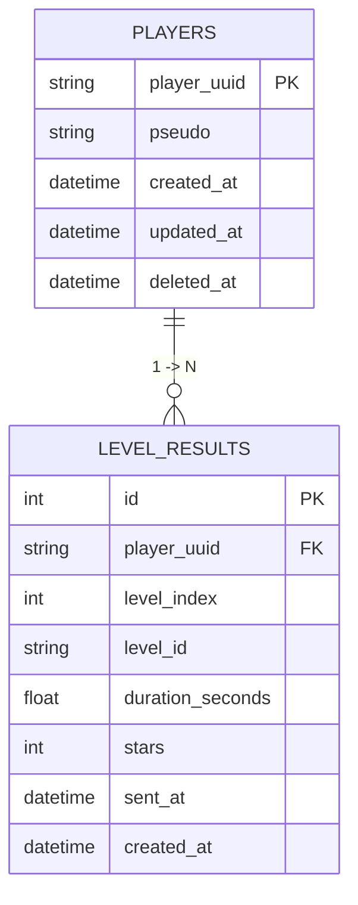

# SafeChem REST API Workspace

Ce dossier contient le backend du prototype `SafeChem Lab`.  
Son rôle est volontairement simple : garder une trace de ce que fait le joueur sans alourdir le projet Unity avec de la logique serveur inutile.

Concrètement, cette API reçoit quelques événements clés :

- la création d'un joueur ;
- la mise à jour de son pseudo ;
- la suppression de son profil ;
- la remontée d'un niveau terminé avec son temps et son score.

Le tout a été pensé pour rester lisible, rapide à lancer en local et facile à reprendre.

Pour une documentation plus exhaustive, voir aussi :

- `API_Workspace/DOC.md`
- `API_Workspace/db_mld.puml`

---

## Pourquoi cette API existe

Le jeu Unity fonctionne d'abord en local. Le backend n'est pas là pour piloter toute la logique métier, mais pour centraliser quelques informations de progression côté serveur :

- qui est le joueur ;
- quel pseudo il utilise ;
- quels niveaux il a terminés ;
- en combien de temps ;
- avec combien d'étoiles.

Cette séparation garde l'expérience de jeu fluide côté Unity tout en posant une base propre pour un suivi externe, des statistiques ou une future synchronisation plus avancée.

---

## Stack choisie

Le choix technique est volontairement sobre :

- `FastAPI` pour exposer les routes REST ;
- `SQLAlchemy` pour manipuler la base sans complexifier le code ;
- `PostgreSQL 16` comme base relationnelle ;
- `Adminer` pour inspecter les données facilement ;
- `Docker Compose` pour démarrer l'ensemble sans installation lourde.

L'idée n'était pas de construire une architecture enterprise, mais un backend clair, maintenable et suffisant pour le prototype.

---

## Lancer le workspace

Depuis `API_Workspace` :

```bash
docker compose up --build
```

Une fois les conteneurs lancés :

- API : `http://localhost:8000`
- Swagger : `http://localhost:8000/docs`
- Adminer : `http://localhost:8080`

Si tu veux repartir d'une base de développement complètement vide :

```bash
docker compose down -v
docker compose up --build
```

Cette commande supprime aussi le volume PostgreSQL local.

---

## Ce que contient le docker-compose

Le workspace s'appuie sur trois services, chacun avec un rôle très simple.

### `api`

Le service `api` embarque l'application FastAPI.  
Le code Python est monté depuis `./Src`, ce qui permet de modifier le backend localement sans reconstruire toute l'image à chaque changement mineur.

### `db`

Le service `db` expose une instance PostgreSQL 16.  
Les données sont stockées dans un volume Docker dédié pour éviter de perdre l'état de la base à chaque redémarrage.

### `adminer`

Le service `adminer` sert uniquement au confort de développement.  
Il permet d'explorer la base visuellement, de vérifier rapidement qu'un joueur a bien été créé, ou qu'un résultat de niveau a bien été inséré.

Paramètres de connexion Adminer :

- Système : `PostgreSQL`
- Serveur : `db`
- Utilisateur : `safechem`
- Mot de passe : `safechem`
- Base : `safechem`

---

## Modèle de données

Le modèle de données actuel est volontairement minimal.  
Il y a deux tables principales :

- `players`
- `level_results`

Le fichier source PlantUML est :

- `API_Workspace/db_mld.puml`

Le schéma ci-dessous reprend ce modèle directement dans le README.



### Lecture du schéma

#### `players`

Cette table représente l'identité du joueur côté backend.

On y retrouve :

- `player_uuid` : l'identifiant unique généré côté Unity ;
- `pseudo` : le pseudo actuellement utilisé ;
- `created_at` et `updated_at` : les dates de création et de mise à jour ;
- `deleted_at` : un champ réservé pour une éventuelle suppression logique plus tard.

#### `level_results`

Cette table contient l'historique des résultats remontés par le jeu.

Chaque ligne décrit une fin de niveau :

- quel joueur est concerné ;
- quel niveau a été terminé ;
- en combien de temps ;
- avec combien d'étoiles ;
- à quelle date l'événement a été envoyé.

#### Relation entre les deux

La relation est simple :

- un joueur peut avoir plusieurs résultats ;
- chaque résultat appartient à un seul joueur.

Ce choix suffit largement pour le besoin actuel du prototype.

---

## Sécurité des appels

Le backend ne se contente pas d'accepter des appels HTTP "nus".  
Une vérification légère a été mise en place entre Unity et l'API à l'aide d'une paire de clés RSA.

Répartition des clés :

- clé privée côté API : `API_Workspace/Src/keys/private_key.pem`
- clé publique côté Unity : `Assets/Resources/Security/game_public_key.xml`

À chaque requête, le client Unity envoie un header :

- `X-Game-Proof`

Ce header contient une preuve chiffrée côté Unity, que l'API déchiffre ensuite avec sa clé privée.  
Le payload logique vérifié correspond à :

```text
safechem-unity-client|<unix_timestamp>
```

L'API contrôle ensuite deux choses :

- que l'identifiant applicatif attendu est bien présent ;
- que l'horodatage reste suffisamment récent.

Si ce contrôle échoue, la requête est rejetée.

Pour régénérer la paire de clés :

```bash
python API_Workspace/Src/tools/generate_keys.py
```

---

## Contrat REST exposé

L'API reste courte et lisible.  
Les routes aujourd'hui utiles au client Unity sont les suivantes.

### `GET /health`

Permet de vérifier que l'API répond correctement.

### `POST /players`

Crée un joueur, ou remet à jour son enregistrement si besoin.

Exemple :

```json
{
  "player_uuid": "9a9f7e9d5f6b4f7cb3f4d6b7d8e9f001",
  "pseudo": "CatalyseurNova",
  "sent_at": "2026-03-17T12:00:00Z"
}
```

### `PATCH /players/{player_uuid}/pseudo`

Met à jour le pseudo du joueur.

Exemple :

```json
{
  "pseudo": "IonSerein",
  "sent_at": "2026-03-17T12:00:00Z"
}
```

### `DELETE /players/{player_uuid}?sent_at=...`

Supprime le joueur et ses résultats associés.

### `POST /levels/finished`

Enregistre une fin de niveau envoyée par Unity.

Exemple :

```json
{
  "player_uuid": "9a9f7e9d5f6b4f7cb3f4d6b7d8e9f001",
  "level_index": 2,
  "level_id": "level-2",
  "duration_seconds": 83.2,
  "stars": 3,
  "sent_at": "2026-03-17T12:00:00Z"
}
```

---

## Lien avec le projet Unity

Côté Unity, le client REST est implémenté dans :

- `Assets/Scripts/BackendApiClient.cs`

Le profil local du joueur est géré dans :

- `Assets/Scripts/HomeSceneLayoutFix.cs`

En pratique, le jeu contacte l'API lors de quatre moments principaux :

- création du profil au premier lancement ;
- changement de pseudo ;
- reset/suppression du profil ;
- fin d'un niveau.

Le backend est donc un complément du jeu local, pas une dépendance bloquante du prototype.  
Si l'API n'est pas disponible, le gameplay local reste la priorité.

---

## Arborescence utile

Quelques fichiers importants à connaître :

- `API_Workspace/docker-compose.yml`
- `API_Workspace/Src/main.py`
- `API_Workspace/Src/Dockerfile`
- `API_Workspace/Src/requirements.txt`
- `API_Workspace/Src/keys/private_key.pem`
- `API_Workspace/Src/tools/generate_keys.py`
- `API_Workspace/db_mld.puml`
- `API_Workspace/DOC.md`

---

## En résumé

Ce workspace backend a été construit pour être :

- simple à démarrer ;
- suffisamment propre pour accompagner le prototype ;
- assez clair pour être repris rapidement ;
- connecté proprement au client Unity.

Il pose une base saine pour le suivi des joueurs et des résultats sans alourdir inutilement le projet.
